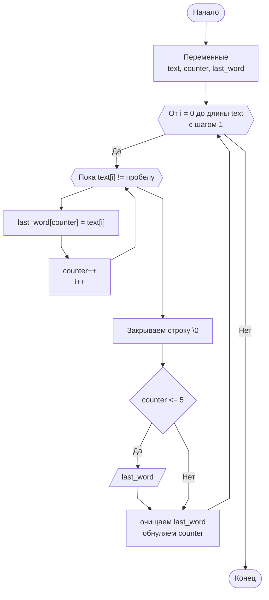

```mermaid
%%{ init: { 'flowchart': { 'curve': 'linear' } } }%%
flowchart TB
    start([Начало]) --> init_var
        
    init_var[Переменные\ntext, counter, last_word]
    loop1{{От i = 0 до длины text\nс шагом 1}}
    loop2{{"Пока text[i] != пробелу"}}
    node1["last_word[counter] = text[i]"]
    node2[counter++\ni++]
    node3[Закрываем строку \0]
    if1{counter <= 5} --Да--> out1[/last_word/] --> node4
    if1 --Нет--> node4
    node4[очищаем last_word\nобнуляем counter]
    
    init_var --> loop1 --Да--> loop2 --> node1
        node1 --> node2 --> loop2
    
    loop2 ----> node3 --> if1
    node4 --> loop1
    loop1 --Нет---------> end_step([Конец])
    
```
