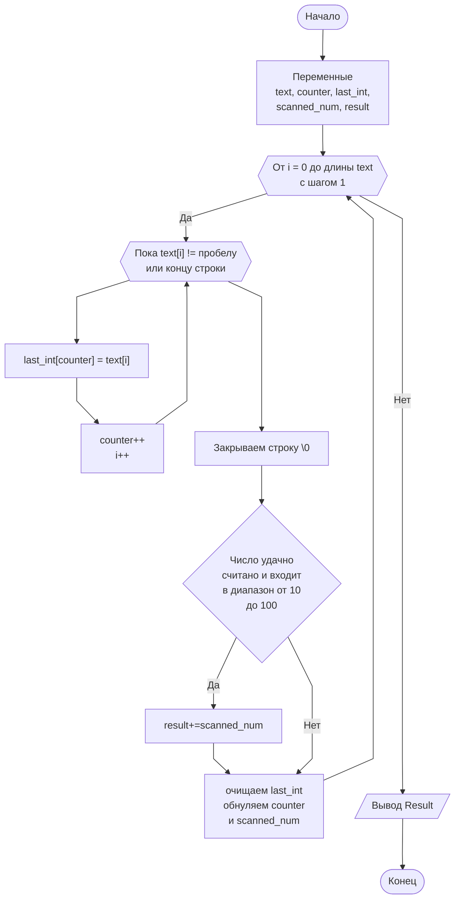

```mermaid
%%{ init: { 'flowchart': { 'curve': 'linear' } } }%%
flowchart TB
    start([Начало]) --> init_var
        
    init_var[Переменные\ntext, counter, last_int,\n scanned_num, result]
    loop1{{От i = 0 до длины text\nс шагом 1}}
    loop2{{"Пока text[i] != пробелу \n или концу строки"}}
    node1["last_int[counter] = text[i]"]
    node2[counter++\ni++]
    node3[Закрываем строку \0]
    if1{Число удачно \n считано и входит\n в диапазон от 10\n до 100} --Да--> node5[result+=scanned_num] --> node4
    if1 --Нет--> node4
    node4[очищаем last_int \n обнуляем counter \n и scanned_num]
    
    init_var --> loop1 --Да--> loop2 --> node1
        node1 --> node2 ----> loop2
    
    loop2 ----> node3 --> if1
    node4 --> loop1
    loop1 --Нет--------> out1[/Вывод Result/] --> end_step([Конец])
    
```
